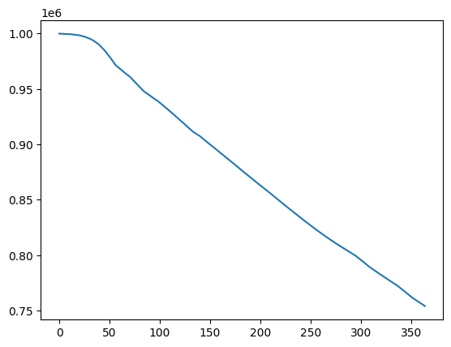

# To-Do List

## Current Problems

### Stochastic Implementation of Compartment Variables

$S$, $E$, $P$, $I$, $A$, and $R$ are described in de Lima *et al.,* (2024) as being implemented either in a deterministic fashion (see Appendix A. Supplementary Methods - Disease Transmission Model) or in a stochastic fashion (Appendix A. Supplementary Methods - Stochastic Implementation). The functions are modelled as follows:

$$
\frac{dS}{dt} = - \lambda_t \odot S \text{, and}
$$

$$
\boldsymbol{S_{t}} = \boldsymbol{S_{t - 1}} - B(\boldsymbol{S_{t - 1}}, 1 - \text{exp}(\frac{-\boldsymbol{\lambda_{t - 1}}}{\boldsymbol{N}}))
$$

However, these two functions should (if I am correct) produce two different infection dynamics, the former producing an exponential decay of the form $Ae^{\lambda}$, while the second should produce a roughly linear decay, as evidenced by this plot of $S$ as a function of time:

There's a possibility that I incorrectly modelled $\frac{dS}{dt}$ (I should've paid more attention in first year calculus :( ) or that the effect of NPIs creates a roughly linear decline, but this is still weird. 

